# WorkDrive 요구사항 분석서

문서번호: [WorkDrive]_요구사항분석서_260515_Doc-005  
프로젝트명: WorkDrive - 클라우드 기반 조직 협업용 파일 공유 시스템  
작성일: 2026-05-15  
작성자: trymimi

---

## 제/개정 이력

| 버전 | 날짜 | 작성자 | 제/개정 사항 | 비고 |
|------|------|--------|--------------|------|
| 1.0 | 2026-05-15 | trymimi | 요구사항 분석서 최초 작성 | ch08 과제 |

## 목차

1. 서론  
   1.1 목적 및 범위  
   1.2 용어 정의  
   1.3 참조 문서  
2. 시스템 개요  
   2.1 소프트웨어 문맥도  
   2.2 기능 분류 및 설명  
3. 요구사항 명세  
   3.1 정적 분석  
   3.2 CRC 카드  
   3.3 동적 분석  
   3.4 상태 분석  
4. 인터페이스 분석  
5. 제약사항  
6. 요구사항 추적표  
7. 참고문헌 및 부록

---

## 1. 서론

### 1.1 목적 및 범위

본 문서는 WorkDrive 클라우드 파일 공유 시스템의 요구사항을 객체지향 분석 관점에서 구체화하는 것을 목적으로 한다. 요구사항 정의서에서 도출한 기능적 요구사항, 비기능적 요구사항, 인터페이스 요구사항을 바탕으로 기능 관점의 유스케이스, 구조 관점의 클래스, 행위 관점의 순차 다이어그램을 작성한다.

본 문서는 다음 내용을 포함한다.

| 구분 | 내용 |
|------|------|
| 기능 관점 분석 | 액터 식별, 유스케이스 다이어그램, 유스케이스 설명 |
| 구조 관점 분석 | 도메인 클래스, 클래스 다이어그램, CRC 카드 |
| 행위 관점 분석 | 주요 시나리오별 순차 다이어그램, 파일 상태 변화 |
| 인터페이스 분석 | 사용자 화면, API, 데이터 저장소, 외부 연동 |
| 추적성 분석 | 요구사항과 유스케이스 간 대응 관계 |

### 1.2 용어 정의

| 용어 | 설명 |
|------|------|
| 사용자 | WorkDrive에 로그인하여 파일 업로드, 다운로드, 공유, 댓글, 검색 기능을 사용하는 일반 이용자 |
| 관리자 | 사용자 계정, 권한 정책, 활동 로그를 관리하는 운영 담당자 |
| RBAC | Role-Based Access Control. 역할 기반 접근 제어 방식 |
| 공유 링크 | 외부 사용자가 특정 파일 또는 폴더에 접근할 수 있도록 생성하는 URL |
| 만료 링크 | 정해진 만료 시각 이후 접근할 수 없도록 제한된 공유 링크 |
| 파일 버전 | 동일 파일의 변경 이력을 구분하기 위해 저장하는 개별 상태 |
| 감사 로그 | 파일 접근, 수정, 공유, 댓글 작성 등 주요 이벤트를 기록한 로그 |
| 유스케이스 | 액터가 시스템을 통해 달성하려는 목표 단위의 시나리오 |
| CRC 카드 | Class, Responsibility, Collaborator를 정리하여 클래스의 책임과 협력 관계를 분석하는 카드 |

### 1.3 참조 문서

| 문서명 | 경로 | 설명 |
|--------|------|------|
| WorkDrive 프로젝트 정의서 | `doc/WorkDrive.md` | 프로젝트 명칭, 시스템 설명, 핵심 기능, 유사 소프트웨어 분석 |
| WorkDrive 품질 요소 측정 | `doc/Quality_Attribute_Measurement.md` | 품질 기대치, 우선순위, 측정 기준 |
| WorkDrive 프로젝트 관리 계획서 | `doc/프로젝트관리계획서.md` | 개발 계획, 품질 관리, 산출물, 리스크 관리 |
| WorkDrive 요구사항 정의서 | `doc/요구사항정의서.md` | 기능적/비기능적/인터페이스 요구사항 |
| 샘플 요구사항 분석서 | `샘플_요구사항분석서.pdf` | 요구사항 분석서 작성 형식 참고 |

---

## 2. 시스템 개요

### 2.1 소프트웨어 문맥도

WorkDrive는 웹 브라우저를 사용하는 사용자와 관리자에게 파일 협업 기능을 제공한다. 시스템 내부에서는 인증, 파일 저장, 공유 권한, 댓글, 버전, 검색, 로그 기능이 동작하며, 외부 저장소와 데이터베이스, 이메일 알림 서비스와 연동할 수 있다.

#### 2.1.1 Actor Table

| Actor | Role |
|-------|------|
| 사용자 | 파일을 업로드, 다운로드, 공유, 검색하고 댓글 및 버전 관리 기능을 사용하는 일반 이용자 |
| 관리자 | 조직 사용자, 계정 상태, 기본 권한 정책, 활동 로그를 관리하는 운영 담당자 |
| 외부 사용자 | 공유 링크를 통해 제한된 파일 또는 폴더에 접근하는 비회원 또는 조직 외부 사용자 |
| 파일 저장소 | 업로드된 실제 파일 바이너리를 저장하고 다운로드 요청 시 파일을 제공하는 외부 또는 내부 저장소 |
| 데이터베이스 | 사용자, 파일 메타데이터, 권한, 댓글, 버전, 로그 데이터를 저장하는 시스템 |
| 이메일 서비스 | 링크 공유, 보안 알림, 계정 관련 알림을 발송할 수 있는 외부 서비스 |

#### 2.1.2 소프트웨어 Context Diagram


#### 2.1.3 UseCase Diagram


### 2.2 기능 분류 및 설명

#### 2.2.1 UseCase 목록

| ID | UseCase Name | 주요 Actor | 중요도 | 관련 요구사항 |
|----|--------------|------------|--------|---------------|
| U_01 | 회원가입을 한다 | 사용자 | High | FR-001, FR-004, NFR-011 |
| U_02 | 로그인을 한다 | 사용자, 관리자 | High | FR-002, FR-003, NFR-009 |
| U_03 | 파일을 업로드한다 | 사용자 | High | FR-006, FR-008, FR-009, FR-010 |
| U_04 | 파일을 다운로드한다 | 사용자, 외부 사용자 | High | FR-007, FR-009, FR-017, FR-018 |
| U_05 | 파일/폴더를 공유한다 | 사용자 | High | FR-011~FR-016, NFR-013 |
| U_06 | 파일 댓글을 관리한다 | 사용자 | Medium | FR-022~FR-026 |
| U_07 | 파일 버전을 관리한다 | 사용자 | High | FR-027~FR-031 |
| U_08 | 파일을 검색한다 | 사용자 | High | FR-032~FR-035, NFR-005 |
| U_09 | 활동 로그를 기록한다 | 시스템 | High | FR-036, FR-038, NFR-008 |
| U_10 | 관리자 기능을 수행한다 | 관리자 | Medium | FR-005, FR-019, FR-037, FR-039 |

#### 2.2.2 UseCase Description - U_01 회원가입을 한다

| 항목 | 내용 |
|------|------|
| Use Case Name | 회원가입을 한다 |
| ID | U_01 |
| Importance Level | High |
| Primary Actor | 사용자 |
| Use Case Type | Detail, Essential |
| Brief Description | 사용자가 이메일, 비밀번호, 이름을 입력하여 WorkDrive 계정을 생성한다. |
| Stakeholders and Interests | 사용자는 계정을 생성하여 파일 협업 기능을 사용하기를 원한다. 시스템은 중복 계정과 보안 취약 비밀번호를 방지해야 한다. |
| Trigger | 사용자가 회원가입 버튼을 누른다. |
| Association | 사용자 |
| Include | 입력값 검증, 비밀번호 해시 저장 |
| Extend | 이메일 인증 |
| Generalization | 없음 |

Normal Flow of Events:

1. 사용자는 이메일, 비밀번호, 이름을 입력한다.
2. 사용자는 회원가입 버튼을 누른다.
3. 시스템은 입력값 누락 여부와 이메일 중복 여부를 확인한다.
4. 시스템은 비밀번호를 안전한 해시 방식으로 저장한다.
5. 시스템은 회원가입 성공 메시지를 표시하고 로그인 화면으로 이동한다.

Alternate / Exceptional Flows:

- 3.a1: 필수 입력값이 누락된 경우 시스템은 누락 항목을 안내한다.
- 3.a2: 이미 가입된 이메일인 경우 시스템은 중복 이메일 메시지를 표시한다.
- 4.a1: 비밀번호 정책을 만족하지 못한 경우 시스템은 비밀번호 조건을 안내한다.

#### 2.2.3 UseCase Description - U_02 로그인을 한다

| 항목 | 내용 |
|------|------|
| Use Case Name | 로그인을 한다 |
| ID | U_02 |
| Importance Level | High |
| Primary Actor | 사용자, 관리자 |
| Use Case Type | Detail, Essential |
| Brief Description | 사용자가 이메일과 비밀번호를 입력하여 WorkDrive에 로그인한다. |
| Stakeholders and Interests | 사용자는 안전하게 인증 후 서비스를 이용하기를 원한다. 관리자는 권한에 맞는 관리 기능을 이용하기를 원한다. |
| Trigger | 사용자가 로그인 버튼을 누른다. |
| Association | 사용자, 관리자 |
| Include | 인증 정보 확인, 세션 생성 |
| Extend | 비밀번호 찾기 |
| Generalization | 없음 |

Normal Flow of Events:

1. 사용자는 이메일과 비밀번호를 입력한다.
2. 사용자는 로그인 버튼을 누른다.
3. 시스템은 입력된 인증 정보를 확인한다.
4. 인증이 성공하면 시스템은 세션을 생성한다.
5. 시스템은 사용자 역할에 따라 메인 화면 또는 관리자 화면으로 이동한다.

Alternate / Exceptional Flows:

- 3.a1: 인증 정보가 일치하지 않으면 시스템은 로그인 실패 메시지를 표시한다.
- 3.a2: 비활성 계정이면 시스템은 계정 상태 오류를 안내한다.
- 4.a1: 세션 생성에 실패하면 시스템은 재시도 안내 메시지를 표시한다.

#### 2.2.4 UseCase Description - U_03 파일을 업로드한다

| 항목 | 내용 |
|------|------|
| Use Case Name | 파일을 업로드한다 |
| ID | U_03 |
| Importance Level | High |
| Primary Actor | 사용자 |
| Use Case Type | Detail, Essential |
| Brief Description | 사용자가 파일을 선택하여 WorkDrive 클라우드 저장소에 업로드한다. |
| Stakeholders and Interests | 사용자는 업무 파일을 안전하게 저장하기를 원한다. 시스템은 파일 메타데이터와 저장 위치를 정확히 관리해야 한다. |
| Trigger | 사용자가 업로드 버튼을 누른다. |
| Association | 사용자 |
| Include | 권한 확인, 파일 저장, 메타데이터 저장, 활동 로그 기록 |
| Extend | 업로드 실패 안내, 버전 생성 |
| Generalization | 없음 |

Normal Flow of Events:

1. 사용자는 업로드할 파일과 대상 폴더를 선택한다.
2. 시스템은 사용자가 대상 폴더에 업로드 권한을 갖는지 확인한다.
3. 시스템은 파일 크기와 확장자 정책을 확인한다.
4. 시스템은 파일 저장소에 파일을 저장한다.
5. 시스템은 파일명, 크기, 확장자, 업로드 사용자, 저장 위치를 데이터베이스에 저장한다.
6. 시스템은 업로드 활동 로그를 기록한다.
7. 시스템은 파일 목록 화면에 새 파일을 표시한다.

Alternate / Exceptional Flows:

- 2.a1: 권한이 없으면 시스템은 업로드를 차단하고 권한 부족 메시지를 표시한다.
- 3.a1: 파일 크기 또는 확장자 정책을 위반하면 시스템은 업로드를 거부한다.
- 4.a1: 저장소 오류가 발생하면 시스템은 기존 데이터가 손상되지 않도록 롤백하고 실패 사유를 표시한다.

#### 2.2.5 UseCase Description - U_04 파일을 다운로드한다

| 항목 | 내용 |
|------|------|
| Use Case Name | 파일을 다운로드한다 |
| ID | U_04 |
| Importance Level | High |
| Primary Actor | 사용자, 외부 사용자 |
| Use Case Type | Detail, Essential |
| Brief Description | 사용자가 접근 권한이 있는 파일을 다운로드한다. |
| Stakeholders and Interests | 사용자는 필요한 파일을 빠르게 내려받기를 원한다. 시스템은 권한 없는 접근을 차단해야 한다. |
| Trigger | 사용자가 다운로드 버튼 또는 공유 링크를 선택한다. |
| Association | 사용자, 외부 사용자 |
| Include | 접근 권한 확인, 파일 스트림 제공, 다운로드 로그 기록 |
| Extend | 링크 만료 안내 |
| Generalization | 없음 |

Normal Flow of Events:

1. 사용자는 다운로드할 파일을 선택한다.
2. 시스템은 사용자의 파일 접근 권한 또는 공유 링크 상태를 확인한다.
3. 시스템은 파일 저장소에서 파일을 조회한다.
4. 시스템은 파일 다운로드 스트림을 제공한다.
5. 시스템은 다운로드 활동 로그를 기록한다.

Alternate / Exceptional Flows:

- 2.a1: 권한이 없으면 시스템은 다운로드를 차단한다.
- 2.a2: 공유 링크가 만료되었으면 시스템은 링크 만료 메시지를 표시한다.
- 3.a1: 파일이 존재하지 않으면 시스템은 파일 없음 메시지를 표시한다.

#### 2.2.6 UseCase Description - U_05 파일/폴더를 공유한다

| 항목 | 내용 |
|------|------|
| Use Case Name | 파일/폴더를 공유한다 |
| ID | U_05 |
| Importance Level | High |
| Primary Actor | 사용자 |
| Use Case Type | Detail, Essential |
| Brief Description | 사용자가 파일 또는 폴더를 다른 사용자, 팀, 부서, 외부 사용자에게 공유한다. |
| Stakeholders and Interests | 사용자는 협업 대상에게 필요한 권한만 부여하기를 원한다. 시스템은 권한 정책과 감사 로그를 유지해야 한다. |
| Trigger | 사용자가 공유 설정 버튼을 누른다. |
| Association | 사용자 |
| Include | 공유 대상 선택, 권한 설정, 권한 저장, 로그 기록 |
| Extend | 외부 공유 링크 생성, 만료 기간 설정 |
| Generalization | 없음 |

Normal Flow of Events:

1. 사용자는 공유할 파일 또는 폴더를 선택한다.
2. 사용자는 공유 대상과 권한(읽기, 수정, 댓글)을 선택한다.
3. 시스템은 사용자가 공유 권한을 변경할 수 있는지 확인한다.
4. 시스템은 권한 데이터를 저장한다.
5. 시스템은 공유 활동 로그를 기록한다.
6. 시스템은 공유 완료 메시지를 표시한다.

Alternate / Exceptional Flows:

- 3.a1: 공유 권한이 없는 사용자인 경우 시스템은 공유 설정을 차단한다.
- 4.a1: 동일 대상에 기존 권한이 있으면 시스템은 기존 권한을 갱신한다.
- 4.a2: 외부 공유 링크가 설정된 경우 시스템은 만료 시점을 함께 저장한다.

#### 2.2.7 UseCase Description - U_06 파일 댓글을 관리한다

| 항목 | 내용 |
|------|------|
| Use Case Name | 파일 댓글을 관리한다 |
| ID | U_06 |
| Importance Level | Medium |
| Primary Actor | 사용자 |
| Use Case Type | Detail, Essential |
| Brief Description | 사용자가 파일에 댓글을 작성, 조회, 수정, 삭제한다. |
| Stakeholders and Interests | 사용자는 파일 단위로 협업 의견을 남기기를 원한다. 시스템은 댓글 권한을 확인해야 한다. |
| Trigger | 사용자가 파일 상세 화면에서 댓글 영역을 연다. |
| Association | 사용자 |
| Include | 댓글 권한 확인, 댓글 저장, 댓글 로그 기록 |
| Extend | 댓글 수정/삭제 |
| Generalization | 없음 |

Normal Flow of Events:

1. 사용자는 파일 상세 화면에서 댓글 목록을 조회한다.
2. 시스템은 파일 접근 권한을 확인한다.
3. 시스템은 댓글 목록을 표시한다.
4. 사용자는 댓글 내용을 입력하고 등록 버튼을 누른다.
5. 시스템은 댓글 작성 권한을 확인한다.
6. 시스템은 댓글 내용, 작성자, 작성 시간을 저장한다.
7. 시스템은 댓글 작성 로그를 기록한다.

Alternate / Exceptional Flows:

- 2.a1: 파일 접근 권한이 없으면 시스템은 댓글 목록을 표시하지 않는다.
- 5.a1: 댓글 작성 권한이 없으면 시스템은 댓글 작성을 차단한다.
- 6.a1: 댓글 내용이 비어 있으면 시스템은 입력 오류를 표시한다.

#### 2.2.8 UseCase Description - U_07 파일 버전을 관리한다

| 항목 | 내용 |
|------|------|
| Use Case Name | 파일 버전을 관리한다 |
| ID | U_07 |
| Importance Level | High |
| Primary Actor | 사용자 |
| Use Case Type | Detail, Essential |
| Brief Description | 사용자가 파일 버전 목록을 조회하고 이전 버전으로 복구한다. |
| Stakeholders and Interests | 사용자는 변경 이력을 확인하고 잘못된 수정 내용을 복구하기를 원한다. 시스템은 버전 무결성을 유지해야 한다. |
| Trigger | 사용자가 버전 관리 화면을 연다. |
| Association | 사용자 |
| Include | 버전 목록 조회, 수정 권한 확인, 복구 처리, 로그 기록 |
| Extend | 동시 수정 충돌 안내 |
| Generalization | 없음 |

Normal Flow of Events:

1. 사용자는 파일 상세 화면에서 버전 목록을 선택한다.
2. 시스템은 사용자의 파일 접근 권한을 확인한다.
3. 시스템은 파일 버전 목록을 표시한다.
4. 사용자는 복구할 버전을 선택한다.
5. 시스템은 사용자의 수정 권한을 확인한다.
6. 시스템은 선택한 버전을 현재 버전으로 복구한다.
7. 시스템은 버전 복구 로그를 기록한다.

Alternate / Exceptional Flows:

- 2.a1: 파일 접근 권한이 없으면 시스템은 버전 목록을 표시하지 않는다.
- 5.a1: 수정 권한이 없으면 시스템은 복구를 차단한다.
- 6.a1: 최신 서버 버전과 충돌이 있으면 시스템은 충돌 경고를 표시한다.

#### 2.2.9 UseCase Description - U_08 파일을 검색한다

| 항목 | 내용 |
|------|------|
| Use Case Name | 파일을 검색한다 |
| ID | U_08 |
| Importance Level | High |
| Primary Actor | 사용자 |
| Use Case Type | Detail, Essential |
| Brief Description | 사용자가 파일명, 업로드 사용자, 날짜, 확장자 조건으로 파일을 검색한다. |
| Stakeholders and Interests | 사용자는 필요한 파일을 빠르게 찾기를 원한다. 시스템은 접근 가능한 파일만 결과로 보여야 한다. |
| Trigger | 사용자가 검색어 또는 필터 조건을 입력한다. |
| Association | 사용자 |
| Include | 검색 조건 입력, 권한 필터링, 결과 정렬 |
| Extend | 검색 결과 없음 안내 |
| Generalization | 없음 |

Normal Flow of Events:

1. 사용자는 검색어 또는 필터 조건을 입력한다.
2. 시스템은 검색 조건을 검증한다.
3. 시스템은 사용자가 접근 가능한 파일 범위에서 검색한다.
4. 시스템은 검색 결과를 정렬 기준에 따라 표시한다.

Alternate / Exceptional Flows:

- 2.a1: 검색 조건이 올바르지 않으면 시스템은 입력 오류를 안내한다.
- 4.a1: 검색 결과가 없으면 시스템은 결과 없음 메시지를 표시한다.

#### 2.2.10 UseCase Description - U_09 활동 로그를 기록한다

| 항목 | 내용 |
|------|------|
| Use Case Name | 활동 로그를 기록한다 |
| ID | U_09 |
| Importance Level | High |
| Primary Actor | 시스템 |
| Use Case Type | Detail, Essential |
| Brief Description | 시스템이 파일 접근, 다운로드, 수정, 공유, 댓글 작성 등 주요 활동을 로그로 기록한다. |
| Stakeholders and Interests | 관리자는 감사와 장애 분석을 위해 정확한 로그를 원한다. 시스템은 필수 이벤트를 누락하지 않아야 한다. |
| Trigger | 파일 또는 권한 관련 주요 이벤트가 발생한다. |
| Association | 시스템 |
| Include | 이벤트 정보 수집, 로그 저장 |
| Extend | 로그 조회, 로그 필터링 |
| Generalization | 없음 |

Normal Flow of Events:

1. 시스템은 파일 접근, 다운로드, 수정, 공유, 댓글 작성 등 이벤트를 감지한다.
2. 시스템은 사용자, 대상 파일, 이벤트 유형, 발생 시각, IP 정보를 수집한다.
3. 시스템은 로그 데이터를 데이터베이스에 저장한다.
4. 시스템은 로그 저장 결과를 내부 상태로 기록한다.

Alternate / Exceptional Flows:

- 3.a1: 로그 저장이 실패하면 시스템은 재시도 큐에 저장하거나 운영자에게 알림을 생성한다.

#### 2.2.11 UseCase Description - U_10 관리자 기능을 수행한다

| 항목 | 내용 |
|------|------|
| Use Case Name | 관리자 기능을 수행한다 |
| ID | U_10 |
| Importance Level | Medium |
| Primary Actor | 관리자 |
| Use Case Type | Detail, Essential |
| Brief Description | 관리자가 사용자 계정, 기본 권한 정책, 활동 로그를 관리한다. |
| Stakeholders and Interests | 관리자는 조직의 파일 공유 보안과 감사 가능성을 유지하기를 원한다. |
| Trigger | 관리자가 관리자 화면에 접근한다. |
| Association | 관리자 |
| Include | 관리자 권한 확인, 사용자 조회, 정책 설정, 로그 필터링 |
| Extend | 계정 비활성화 |
| Generalization | 없음 |

Normal Flow of Events:

1. 관리자는 관리자 화면에 접근한다.
2. 시스템은 관리자 권한을 확인한다.
3. 관리자는 사용자 목록, 기본 권한 정책, 활동 로그 중 관리할 항목을 선택한다.
4. 시스템은 선택한 관리 데이터를 표시한다.
5. 관리자는 계정 상태 변경, 정책 수정, 로그 필터링을 수행한다.
6. 시스템은 변경 내용을 저장하고 관리 로그를 기록한다.

Alternate / Exceptional Flows:

- 2.a1: 관리자 권한이 없으면 시스템은 접근을 차단한다.
- 5.a1: 정책 변경이 보안 기준을 위반하면 시스템은 저장을 거부한다.

---

## 3. 요구사항 명세

### 3.1 정적 분석

WorkDrive의 핵심 도메인 객체는 사용자, 역할, 파일, 폴더, 공유 권한, 공유 링크, 댓글, 파일 버전, 활동 로그로 구성된다. 파일과 폴더는 조직 협업의 중심 자원이며, 권한과 로그는 보안 및 감사 요구사항을 만족하기 위한 핵심 객체이다.

#### 3.1.1 Class Diagram


### 3.2 CRC 카드

#### 3.2.1 User

| 항목 | 내용 |
|------|------|
| Class Name | User |
| ID | C_01 |
| Type | Concrete, Domain |
| Description | WorkDrive를 사용하는 일반 사용자 정보를 나타낸다. |
| Associated Use Case | U_01, U_02, U_03, U_04, U_05, U_06, U_07, U_08 |

| Responsibilities | Collaborators |
|------------------|---------------|
| 회원가입 정보를 제공한다. | Database |
| 로그인 인증을 요청한다. | Role |
| 파일을 업로드, 다운로드, 검색한다. | FileItem, Folder |
| 파일 공유와 댓글 작성을 수행한다. | SharePermission, Comment |

Attributes:

- userId: String
- email: String
- passwordHash: String
- name: String
- status: String
- organizationId: String

Relationships:

- Generalization: Admin
- Aggregation: Role
- Other Associations: FileItem, Comment, ActivityLog

#### 3.2.2 Admin

| 항목 | 내용 |
|------|------|
| Class Name | Admin |
| ID | C_02 |
| Type | Concrete, Domain |
| Description | 사용자와 권한 정책, 감사 로그를 관리하는 관리자 역할을 나타낸다. |
| Associated Use Case | U_02, U_10 |

| Responsibilities | Collaborators |
|------------------|---------------|
| 사용자 계정 상태를 관리한다. | User |
| 기본 권한 정책을 설정한다. | Role, SharePermission |
| 활동 로그를 조회하고 필터링한다. | ActivityLog |

Attributes:

- adminId: String
- roleName: String

Relationships:

- Generalization: User
- Other Associations: Role, ActivityLog

#### 3.2.3 FileItem

| 항목 | 내용 |
|------|------|
| Class Name | FileItem |
| ID | C_03 |
| Type | Concrete, Domain |
| Description | WorkDrive에 업로드된 파일의 메타데이터와 파일 작업을 나타낸다. |
| Associated Use Case | U_03, U_04, U_05, U_06, U_07, U_08 |

| Responsibilities | Collaborators |
|------------------|---------------|
| 파일 메타데이터를 관리한다. | Database |
| 파일 업로드와 다운로드 요청을 처리한다. | StorageService |
| 파일 버전, 댓글, 공유 권한과 연결된다. | FileVersion, Comment, SharePermission |

Attributes:

- fileId: String
- fileName: String
- size: Long
- extension: String
- storagePath: String
- ownerId: String
- createdAt: Date
- updatedAt: Date

Relationships:

- Aggregation: FileVersion
- Other Associations: Folder, SharePermission, Comment, ActivityLog

#### 3.2.4 Folder

| 항목 | 내용 |
|------|------|
| Class Name | Folder |
| ID | C_04 |
| Type | Concrete, Domain |
| Description | 파일을 분류하고 계층적으로 관리하기 위한 폴더를 나타낸다. |
| Associated Use Case | U_03, U_05, U_08 |

| Responsibilities | Collaborators |
|------------------|---------------|
| 폴더 생성과 이름 변경을 처리한다. | User |
| 파일을 폴더 단위로 분류한다. | FileItem |
| 폴더 공유 권한을 적용한다. | SharePermission |

Attributes:

- folderId: String
- name: String
- parentFolderId: String
- ownerId: String

Relationships:

- Aggregation: FileItem
- Other Associations: SharePermission

#### 3.2.5 SharePermission

| 항목 | 내용 |
|------|------|
| Class Name | SharePermission |
| ID | C_05 |
| Type | Concrete, Domain |
| Description | 파일 또는 폴더에 대한 사용자별, 팀별 접근 권한을 나타낸다. |
| Associated Use Case | U_04, U_05, U_06, U_07, U_08 |

| Responsibilities | Collaborators |
|------------------|---------------|
| 읽기, 수정, 댓글 권한을 부여한다. | User, Role |
| 권한 변경과 해제를 처리한다. | FileItem, Folder |
| 비인가 접근을 차단하는 판단 근거를 제공한다. | ActivityLog |

Attributes:

- permissionId: String
- resourceId: String
- targetId: String
- targetType: String
- permissionType: String
- grantedAt: Date

Relationships:

- Other Associations: User, FileItem, Folder, ActivityLog

#### 3.2.6 ShareLink

| 항목 | 내용 |
|------|------|
| Class Name | ShareLink |
| ID | C_06 |
| Type | Concrete, Domain |
| Description | 외부 공유를 위해 생성되는 링크와 만료 정보를 나타낸다. |
| Associated Use Case | U_04, U_05 |

| Responsibilities | Collaborators |
|------------------|---------------|
| 공유 링크를 생성한다. | FileItem |
| 링크 토큰과 만료 시점을 검증한다. | SharePermission |
| 만료된 링크 접근을 차단한다. | ActivityLog |

Attributes:

- linkId: String
- fileId: String
- token: String
- expiresAt: Date
- active: Boolean

Relationships:

- Other Associations: FileItem, ActivityLog

#### 3.2.7 Comment

| 항목 | 내용 |
|------|------|
| Class Name | Comment |
| ID | C_07 |
| Type | Concrete, Domain |
| Description | 파일에 작성되는 협업 의견을 나타낸다. |
| Associated Use Case | U_06 |

| Responsibilities | Collaborators |
|------------------|---------------|
| 댓글 작성, 수정, 삭제를 처리한다. | User |
| 댓글 작성 권한을 확인한다. | SharePermission |
| 댓글 활동 로그를 남긴다. | ActivityLog |

Attributes:

- commentId: String
- fileId: String
- writerId: String
- content: String
- createdAt: Date
- updatedAt: Date

Relationships:

- Other Associations: User, FileItem, SharePermission

#### 3.2.8 FileVersion

| 항목 | 내용 |
|------|------|
| Class Name | FileVersion |
| ID | C_08 |
| Type | Concrete, Domain |
| Description | 파일의 변경 이력과 복구 가능한 버전 정보를 나타낸다. |
| Associated Use Case | U_03, U_07 |

| Responsibilities | Collaborators |
|------------------|---------------|
| 새 파일 버전을 생성한다. | FileItem |
| 버전 목록을 제공한다. | User |
| 이전 버전 복구를 처리한다. | StorageService |
| 동시 수정 충돌을 판단한다. | SharePermission |

Attributes:

- versionId: String
- fileId: String
- versionNo: Integer
- storagePath: String
- createdBy: String
- createdAt: Date
- changeReason: String

Relationships:

- Aggregation: FileItem
- Other Associations: StorageService, ActivityLog

#### 3.2.9 ActivityLog

| 항목 | 내용 |
|------|------|
| Class Name | ActivityLog |
| ID | C_09 |
| Type | Concrete, Domain |
| Description | 파일 접근, 수정, 공유, 댓글 작성 등 주요 활동을 기록한다. |
| Associated Use Case | U_03, U_04, U_05, U_06, U_07, U_09, U_10 |

| Responsibilities | Collaborators |
|------------------|---------------|
| 주요 이벤트를 로그로 저장한다. | User, FileItem |
| 관리자 조회와 필터링을 지원한다. | Admin |
| 감사 추적 정보를 제공한다. | Database |

Attributes:

- logId: String
- userId: String
- resourceId: String
- eventType: String
- ipAddress: String
- occurredAt: Date

Relationships:

- Other Associations: User, FileItem, Admin

#### 3.2.10 StorageService

| 항목 | 내용 |
|------|------|
| Class Name | StorageService |
| ID | C_10 |
| Type | Service |
| Description | 실제 파일 바이너리 저장, 조회, 삭제를 담당하는 저장소 연동 서비스이다. |
| Associated Use Case | U_03, U_04, U_07 |

| Responsibilities | Collaborators |
|------------------|---------------|
| 파일을 저장소에 저장한다. | FileItem |
| 파일 다운로드 스트림을 제공한다. | FileVersion |
| 파일 삭제와 복구를 지원한다. | Database |

Attributes:

- storageType: String
- basePath: String

Relationships:

- Other Associations: FileItem, FileVersion

### 3.3 동적 분석

#### 3.3.1 파일 업로드 순차 다이어그램

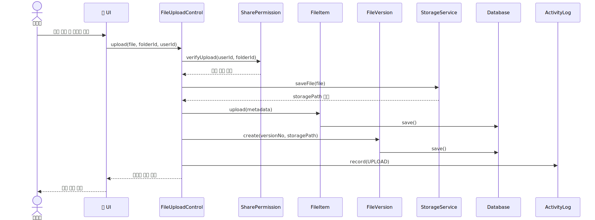

#### 3.3.2 파일 공유 순차 다이어그램

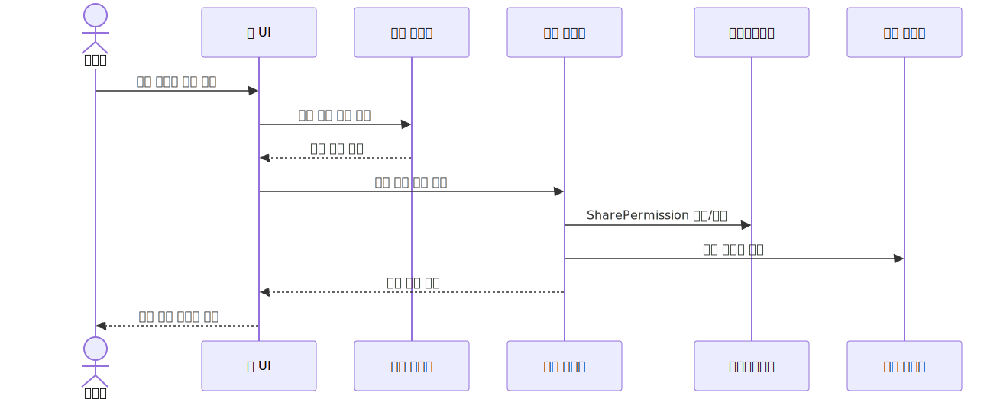

#### 3.3.3 파일 댓글 순차 다이어그램

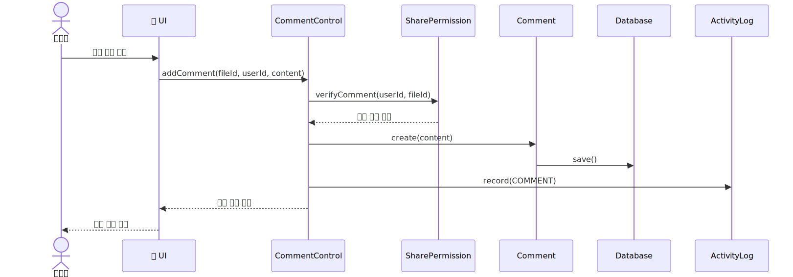

#### 3.3.4 버전 복구 순차 다이어그램

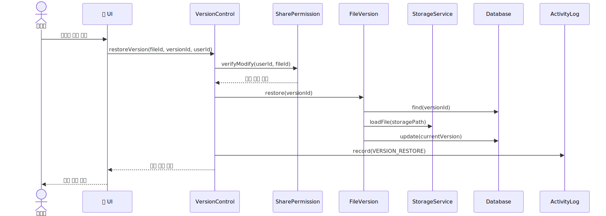

#### 3.3.5 검색 순차 다이어그램

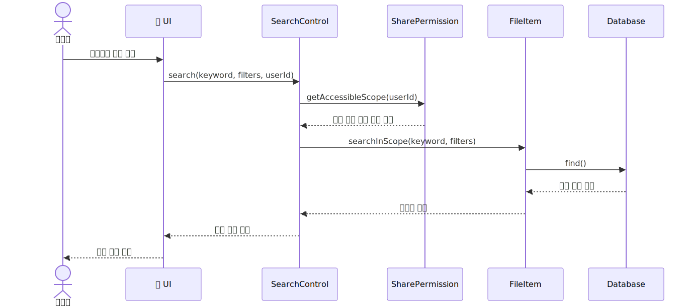

#### 3.3.6 관리자 로그 조회 순차 다이어그램

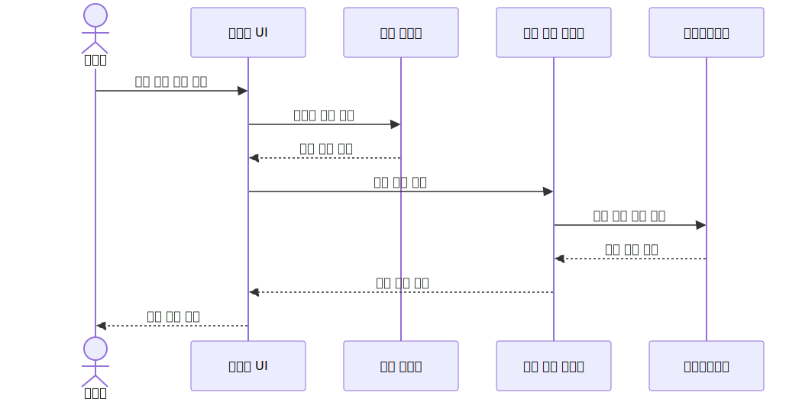

### 3.4 상태 분석

#### 3.4.1 파일 상태 다이어그램


#### 3.4.2 공유 링크 상태 다이어그램


---

## 4. 인터페이스 분석

### 4.1 사용자 인터페이스

| 화면 | 주요 기능 | 관련 요구사항 |
|------|-----------|---------------|
| 회원가입 화면 | 이메일, 비밀번호, 이름 입력 및 계정 생성 | FR-001 |
| 로그인 화면 | 이메일/비밀번호 인증, 세션 생성 | FR-002, FR-003 |
| 파일 목록 화면 | 파일명, 소유자, 수정 일시, 크기, 공유 상태 표시 | FR-006~FR-010, IR-002 |
| 파일 업로드 화면 | 파일 선택, 폴더 선택, 업로드 진행 상태 표시 | FR-006, FR-008, NFR-020 |
| 공유 설정 화면 | 공유 대상, 권한, 만료 링크 설정 | FR-011~FR-016, IR-003 |
| 파일 상세 화면 | 댓글, 버전 목록, 다운로드, 활동 정보 표시 | FR-022~FR-031 |
| 검색 화면 | 검색어, 필터, 정렬 조건 입력 | FR-032~FR-035 |
| 관리자 화면 | 사용자 관리, 권한 정책, 감사 로그 조회 | FR-005, FR-019, FR-037, FR-039 |

### 4.2 API 인터페이스

| API 분류 | 예시 엔드포인트 | 설명 |
|----------|----------------|------|
| 인증 API | `POST /auth/signup`, `POST /auth/login` | 회원가입과 로그인 처리 |
| 파일 API | `POST /files`, `GET /files/{id}/download` | 파일 업로드와 다운로드 처리 |
| 공유 API | `POST /files/{id}/shares`, `PATCH /shares/{id}` | 공유 권한 설정과 변경 |
| 댓글 API | `GET /files/{id}/comments`, `POST /files/{id}/comments` | 댓글 조회와 작성 |
| 버전 API | `GET /files/{id}/versions`, `POST /versions/{id}/restore` | 버전 조회와 복구 |
| 검색 API | `GET /files/search` | 파일 검색과 필터링 |
| 로그 API | `GET /admin/audit-logs` | 관리자 감사 로그 조회 |

### 4.3 데이터 인터페이스

| 데이터 | 주요 속성 | 설명 |
|--------|-----------|------|
| User | userId, email, passwordHash, name, status | 사용자 및 관리자 계정 정보 |
| FileItem | fileId, fileName, size, extension, storagePath, ownerId | 파일 메타데이터 |
| Folder | folderId, name, parentFolderId, ownerId | 폴더 구조 정보 |
| SharePermission | permissionId, resourceId, targetId, permissionType | 공유 권한 정보 |
| ShareLink | linkId, fileId, token, expiresAt, active | 외부 공유 링크 정보 |
| Comment | commentId, fileId, writerId, content | 파일 댓글 정보 |
| FileVersion | versionId, fileId, versionNo, storagePath | 파일 버전 정보 |
| ActivityLog | logId, userId, resourceId, eventType, occurredAt | 활동 및 감사 로그 정보 |

### 4.4 외부 인터페이스

| 외부 요소 | 연동 목적 | 주요 고려사항 |
|-----------|-----------|---------------|
| 파일 저장소 | 실제 파일 저장 및 다운로드 제공 | 저장 실패 시 롤백, 파일 무결성 |
| 데이터베이스 | 메타데이터, 권한, 댓글, 버전, 로그 저장 | 트랜잭션, 인덱스, 백업 |
| 이메일 서비스 | 계정 안내, 공유 알림, 보안 알림 | 개인정보 보호, 전송 실패 처리 |
| 브라우저 | 사용자와 관리자 UI 제공 | 최신 브라우저 호환성, HTTPS 통신 |

---

## 5. 제약사항

| 분류 | 제약사항 |
|------|----------|
| 운영 환경 | 시스템은 네트워크 연결이 가능한 웹 브라우저 환경에서 동작해야 한다. |
| 보안 | 모든 주요 기능은 로그인 인증과 접근 권한 확인을 거쳐야 한다. |
| 저장소 | 파일 저장소 오류 발생 시 메타데이터와 실제 파일 상태가 불일치하지 않도록 처리해야 한다. |
| 성능 | 검색 응답 P95 2초 이내, 다운로드 스트림 시작 P95 3초 이내를 목표로 한다. |
| 개인정보 | 사용자 이메일, 비밀번호 등 개인정보는 보호 정책과 보안 기준을 준수해야 한다. |
| 문서 관리 | 산출물은 Markdown 형식으로 작성하고 GitHub 저장소에서 관리한다. |

---

## 6. 요구사항 추적표

### 6.1 UseCase와 기능 요구사항 매핑

| 요구사항 | U_01 | U_02 | U_03 | U_04 | U_05 | U_06 | U_07 | U_08 | U_09 | U_10 |
|----------|:----:|:----:|:----:|:----:|:----:|:----:|:----:|:----:|:----:|:----:|
| FR-001 | O | | | | | | | | | |
| FR-002 | | O | | | | | | | | |
| FR-003 | | O | O | O | O | O | O | O | | O |
| FR-004 | O | | | | | | | | | |
| FR-005 | | | | | | | | | | O |
| FR-006 | | | O | | | | | | | |
| FR-007 | | | | O | | | | | | |
| FR-008 | | | O | | | | | | | |
| FR-009 | | | O | O | | | | | | |
| FR-010 | | | O | | | | | O | | |
| FR-011 | | | | | O | | | | | |
| FR-012 | | | | | O | O | | | | |
| FR-013 | | | | | O | | | | | |
| FR-014 | | | | | O | | | | | |
| FR-015 | | | | | O | | | | | |
| FR-016 | | | | | O | | | | | |
| FR-017 | | | O | O | O | O | O | O | | O |
| FR-018 | | | O | O | O | O | O | O | | |
| FR-019 | | | | | | | | | | O |
| FR-020 | | | | | O | | | | O | O |
| FR-021 | | | O | | O | | | O | | |
| FR-022 | | | | | | O | | | | |
| FR-023 | | | | | | O | | | | |
| FR-024 | | | | | | O | | | | |
| FR-025 | | | | | | O | | | O | |
| FR-026 | | | | | | O | | | | |
| FR-027 | | | O | | | | O | | | |
| FR-028 | | | | | | | O | | | |
| FR-029 | | | | | | | O | | | |
| FR-030 | | | | | | | O | | | |
| FR-031 | | | | | | | O | | | |
| FR-032 | | | | | | | | O | | |
| FR-033 | | | | | | | | O | | |
| FR-034 | | | | | | | | O | | |
| FR-035 | | | | | | | | O | | |
| FR-036 | | | O | O | O | O | O | O | O | O |
| FR-037 | | | | | | | | | | O |
| FR-038 | | | | | | | | | O | |
| FR-039 | | | | | | | | | | O |

### 6.2 UseCase와 비기능/인터페이스 요구사항 매핑

| 요구사항 | U_01 | U_02 | U_03 | U_04 | U_05 | U_06 | U_07 | U_08 | U_09 | U_10 |
|----------|:----:|:----:|:----:|:----:|:----:|:----:|:----:|:----:|:----:|:----:|
| NFR-001 | O | O | O | O | O | O | O | O | O | O |
| NFR-005 | | | | | | | | O | | |
| NFR-006 | | | O | O | | | | | | |
| NFR-007 | | | | | | O | | | | |
| NFR-009 | | O | O | O | O | O | O | O | | O |
| NFR-010 | | | O | O | O | O | O | O | | O |
| NFR-013 | | | | O | O | | | | | |
| NFR-014 | | | | | O | | | | O | O |
| NFR-015 | | | O | | | | | | | |
| NFR-016 | | | | | | | O | | | |
| NFR-017 | | | O | | | | O | | | |
| NFR-019 | O | O | O | O | O | O | O | O | | O |
| NFR-020 | | | O | O | O | O | O | O | | |
| NFR-021 | O | O | O | O | O | O | O | O | | O |
| IR-001 | O | O | O | O | O | O | O | O | | O |
| IR-002 | | | O | O | O | | | O | | |
| IR-003 | | | | | O | | | | | |
| IR-004 | | | | | | | O | | | |
| IR-005 | | | | | | | | | | O |
| IR-006 | O | O | O | O | O | O | O | O | O | O |
| IR-007 | | | O | O | | | O | | | |
| IR-008 | O | O | O | O | O | O | O | O | O | O |
| IR-014 | | | | | | | | | O | O |

---

## 7. 참고문헌 및 부록

### 7.1 참고문헌

- WorkDrive 프로젝트 정의서
- WorkDrive 품질 요소 측정 문서
- WorkDrive 프로젝트 관리 계획서
- WorkDrive 요구사항 정의서
- 샘플 요구사항 분석서

### 7.2 부록

- 부록 1: `doc/WorkDrive.md` - 프로젝트 정의서
- 부록 2: `doc/Quality_Attribute_Measurement.md` - 품질 요소 측정 문서
- 부록 3: `doc/프로젝트관리계획서.md` - 프로젝트 관리 계획서
- 부록 4: `doc/요구사항정의서.md` - 요구사항 정의서
- 부록 5: `README.md` - 저장소 구조 및 과제 결과물 위치
